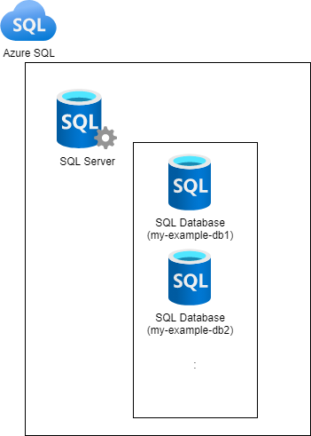
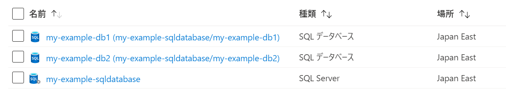
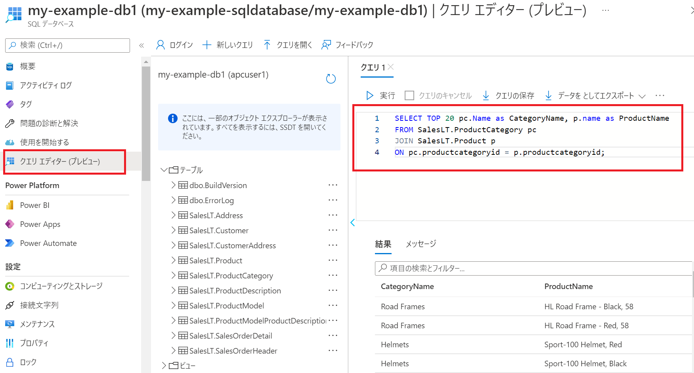

# sql server

MicrosoftのRDBです。

## 他DB(postgres, mysql)との大きな違い

「Transact-SQL（T-SQL）」 を利用する。  
T-SQLとはSQLを拡張した言語。

## Azureでのsql server (Azure SQL)

Azureで sql server を利用する場合, Azure SQL を利用する。
Azure SQL は SQL Server データベース エンジンを使用したDBサービス(PaaS)。

| Azure SQLのサービス | 特徴 | 備考 |
| --- | --- | --- |
| Azure SQL Database | SQL Server の PaaS<br> マネージド | 新規で作成するならこれ。|
| Azure SQL Managed Instance | オンプレからクラウドへの移行に最適化 | オンプレからのリフトならこれ |
| Azure VM 上の SQL Server | VM上で動かすSQL Server<br>SQL Server VM イメージ　を利用する<br>アンマネージド | OSレベルのアクセスが必要な場合や柔軟なカスタマイズが必要な場合。|

今回は Azure SQL Database を利用します。



Azure Portalで確認すると１つのSQL Serverに２つのDatabase。


## 触ってみる　Azure SQL Database
login="apcuser1"
password="Password@123"

db server作成
```
az sql server create --name my-example-sqldb-server \
--resource-group $RG_NAME --location $LOCATION \
--admin-user $login --admin-password $password
```

firewall設定　※外部からアクセス可能に
startIp=123.48.1.91
endIp=123.48.1.91
```
echo "Configuring firewall..."
az sql server firewall-rule create --resource-group $RG_NAME --server my-example-sqldb-server -n AllowYourIp --start-ip-address $startIp --end-ip-address $endIp
```

単一データベースを作成
```
echo "Creating $database on $server..."
az sql db create \
--resource-group $RG_NAME --server my-example-sqldb-server \
--name my-example-db2 \
--sample-name AdventureWorksLT \
--edition GeneralPurpose --family Gen5 --capacity 2 --zone-redundant true 
# zone redundancy is only supported on premium and business critical service tiers
```

### DBに接続して動作確認

1. Azure portalからSQLを発行して確認
Azure portalのクエリーエディタが利用可能。※これが一番簡単にアクセスする方法


2. SQL Server コマンドライン ツール (sqlcmd) Ubuntu linux

sqlcmdのインストール
```
sudo apt-get update 
sudo apt install curl
curl https://packages.microsoft.com/keys/microsoft.asc | sudo apt-key add -
curl https://packages.microsoft.com/config/ubuntu/20.04/prod.list | sudo tee /etc/apt/sources.list.d/msprod.list
sudo apt-get update
sudo apt-get install mssql-tools unixodbc-dev
```

version確認
```
sqlcmd -? 
Microsoft (R) SQL Server Command Line Tool
Version 17.10.0001.1 Linux
Copyright (C) 2017 Microsoft Corporation. All rights reserved.
```

作成したDBに接続してみる
```
# 接続 (-d で dbを指定して接続)
sqlcmd -S my-example-sqldatabase.database.windows.net -U apcuser1 -P '<YourPassword>' -d my-example-db1
```

tableの一覧
```
select name from sysobjects where xtype = 'U';
go
```

終了
```
exit
```

3. 上記以外にも、
VS Codeの拡張機能, SQL Server Management Studio, Azure Data Studio, Docker などが利用可能。
（他のDBも同様だが多数ありすぎて迷う）

## 「Transact-SQL（T-SQL）」の特徴

「条件分岐や繰り返しなどを含む複雑な制御構造などを記述することができる。」

他のDBと比較しての大きな違いがあまりわからない。（★要確認）

## 料金
他のDBと比較して料金の設定はどうか？ (★要確認　他とくらべると高め？？)
| 料金モデル | |
| --- | --- |
| vCore モデル | |
| DTU モデル | 従来型 |
 