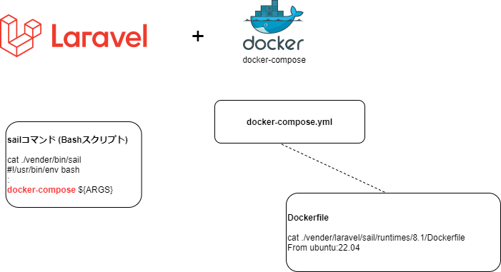

# Laravel Sail



https://readouble.com/laravel/8.x/ja/sail.html

Laravel Sail とは docker開発環境を操作するためのコマンドです。

本質は docker-compose.yml と sailスクリプト です。
sailスクリプト (./vender/bin/sail) は bash です。

# 環境 (dockerが必要)
```
$ cat /etc/os-release 
NAME="Ubuntu"
VERSION="20.04.4 LTS (Focal Fossa)"

$ php -v
PHP 7.4.3 (cli) (built: Jun 13 2022 13:43:30) ( NTS )

$ composer -V
Composer version 2.3.9 2022-07-05 16:52:11

$ docker -v
Docker version 20.10.17, build 100c701
docker-compose -v 
docker-compose version 1.29.2, build 5becea4c
```

# LLaravel プロジェクトの新規作成

https://readouble.com/laravel/8.x/ja/starter-kits.html

スターターキットを利用してプロジェクトを作成する (sailが含まれている)
```
curl -s https://laravel.build/my-example-sail-app | bash
:
（しばらく待つ）
:
Thank you! We hope you build something incredible. Dive in with: cd my-example-sail-app && ./vendor/bin/sail up
```

docker-compose.ymlを確認すると
```
cat docker-compose.yml
version: '3'
services:
    laravel.test:
    mysql:
        image: 'mysql/mysql-server:8.0'
    redis:
        image: 'redis:alpine'
    meilisearch:
        image: 'getmeili/meilisearch:latest'
    mailhog:
        image: 'mailhog/mailhog:latest'
    selenium:
        image: 'selenium/standalone-chrome'
```
すぐに利用できるようにmysql, redis, meilisearch(全文検索エンジン), mailhog(メールサーバー), selenium が含まれている。

# Sail
https://readouble.com/laravel/8.x/ja/sail.html


起動、停止
```
./vendor/bin/sail up
./vendor/bin/sail up -d
./vendor/bin/sail stop
```

各コンテナが起動している様子。各コンテナはDockerボリュームを利用しているのでデータはローカルDiskに保存される。  
（※詳しくはdocker-compose.ymlを参照する）
```
$ docker ps
CONTAINER ID   IMAGE                         ...
288b7bf50e74   sail-8.1/app                  ...
dec28f65201d   mysql/mysql-server:8.0        ...
e250d73822ef   redis:alpine                  ...
d8db5a903af1   getmeili/meilisearch:latest   ...
dc598b09ae35   mailhog/mailhog:latest        ...
3d01646965b7   selenium/standalone-chrome    ...
```

各種コマンドはsail経由で実行する
```
# artisanコマンド
./vendor/bin/sail artisan queue:work

# phpコマンド
./vendor/bin/sail php -v
./vendor/bin/sail php script.php

# Composerコマンド
./vendor/bin/sail composer require laravel/sanctum

# Node／NPMコマンド
./vendor/bin/sail node --version
```

## PHPのバージョンを変更してみる
docker-compose.yml を変更して build しなおす。   
image名の一緒に変更
```
cat docker-compose.yml
:
            #context: ./vendor/laravel/sail/runtimes/8.1
            context: ./vendor/laravel/sail/runtimes/7.4
:
        #image: sail-8.1/app
        image: sail-7.4/app
:
./vendor/bin/sail build --no-cache
```

再起動して確認
```
./vendor/bin/sail up -d
./vendor/bin/sail php -v
```

## Nodeバージョンを変更
docker-compose.yml を変更して build しなおす。
```
cat docker-compose.yml
:
                # NODE_VERSION default: 16
                NODE_VERSION: '14'
:
./vendor/bin/sail build --no-cache
```

再起動して確認
```
./vendor/bin/sail node -v
```