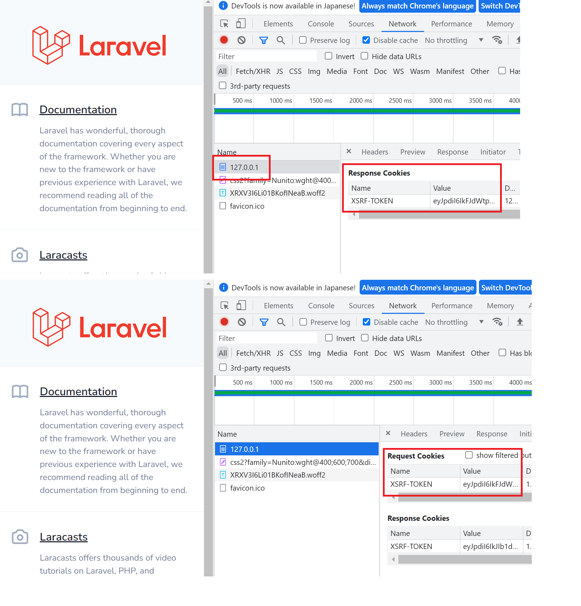
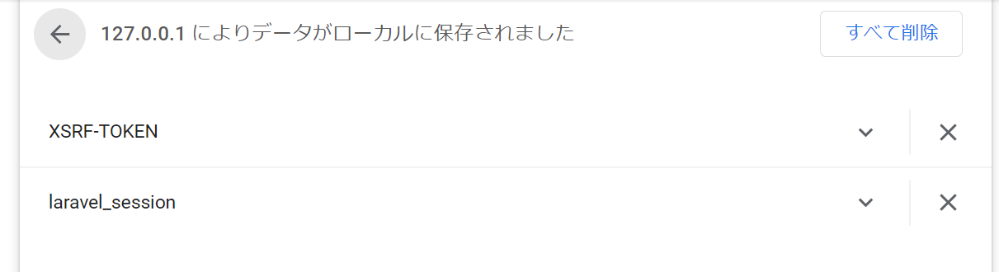

# Laravel webアプリ開発 (基礎)

https://readouble.com/laravel/8.x/ja/
このページの `基礎` のところの解説です。

ボリュームが結構あるので１週間くらいにかけて実施。
PHPのプログラミング基礎があるとスムーズに理解できる(はずです)。

LaravelはフルスタックのフレームワークとしてFrontendとBackendの要素を包括しているがBackend APIとしてのみの利用も可能。

## 基礎
| 用語 | 概要 | 備考 |
| --- | --- | --- |
| ルーティング | API用、WEB用とわけて管理する | |
| ミドルウェア | clientとアプリケーションの間で「検査・フィルタリング」機能を提供するレイヤー <br>app/Http/Kernel.php で各ルートに対して設定する| |
| CSRF保護 | POST、PUT、PATCH、DELETEリクエストから悪意のあるアプリケーションを保護する<br>Laravelがユーザーセッションごとにトークンを自動的に生成、トークンはユーザーのセッションに保存<br><br>Kernel.phpのwebのミドルウェアにVerifyCsrfTokenを設定されている。apiは設定されていないのでCSRF保護は無効<br><br><br>Laravel Sanctum（サンクタム、聖所） | |
| コントローラ | ルートファイルのクロージャをコントローラークラスとして定義<br>クラス分けの方法の推奨 | |
| リクエスト | | |
| レスポンス | | |
| ビュー | | |
| Bladeテンプレート | テンプレートエンジン<br>resources/views/xxx.blade.php | | |
| URL生成 | | |
| セッション | | |
| バリデーション | | |
| エラー処理 | | |
| ログ | Monologライブラリ<br>設定は config/logging.php | |

## 環境
windows WSL2(Ubuntu) を利用しています。

```
$ cat /etc/os-release 
NAME="Ubuntu"
VERSION="20.04.4 LTS (Focal Fossa)"

$ php -v
PHP 7.4.3 (cli) (built: Jun 13 2022 13:43:30) ( NTS )

$ composer -V
Composer version 2.3.9 2022-07-05 16:52:11
```

## Laravelプロジェクトの作成

作成とバージョン
```
composer create-project --prefer-dist laravel/laravel my-laravel-basic
cd my-laravel-basic
php artisan --version
```

確認
```
tree -L 1
.
├── README.md
├── app
├── artisan
├── bootstrap
├── composer.json
├── composer.lock
├── config
├── database
├── package.json
├── phpunit.xml
├── public
├── resources
├── routes
├── server.php
├── storage
├── tests
├── vendor
└── webpack.mix.js
```

起動
```
php artisan serve
```

## ルーティング

URIとクロージャを引数に取る関数として実装していきます。
api.php,web.phpなどに定義される。

```
├── routes
│   ├── api.php       ★ Api用のルート
│   ├── channels.php
│   ├── console.php
│   └── web.php       ★ Webインターフェイス用のルート
```

api.phpは RouteServiceProvider.php で以下のように設定されている。
```
        $this->routes(function () {
            Route::prefix('api')
                ->middleware('api')
                ->namespace($this->namespace)
                ->group(base_path('routes/api.php'));
```
prefix('api')が設定されているのでアクセスする場合は以下のようになる。
```
curl http://127.0.0.1:8000/api/myapi
```

レート制限の定義(RouteServiceProvider.php) レート制限を超えると、429 HTTPステータスコードのレスポンスを返す

オリジン間リソース共有 (CORS)
config/cors.php

ルートのキャッシュ(php artisan route:cache)
プロジェクトのデプロイ中にのみroute：cacheコマンドを実行する
```
php artisan route:cache
php artisan route:clear
```

## ミドルウェア 
HTTPリクエストを検査およびフィルタリングする。
HTTPリクエストがアプリケーションに到達する前に通過しなければならない一連の「レイヤー」としてとらえる。

ミドルウェアの作成
```
php artisan make:middleware MyEnsureTokenIsValid

#クラスが作成されます
cat app/http/Middleware/MyEnsureTokenIsValid.php
```

ミドルウェアの登録

グローバルミドルウェア(app/Http/Kernel.php), ルートに対するミドルウェアの指定とそれぞれのルートごとの設定が可能。


### routes/web.php と routes/api.php
デフォルトでwebとapiの設定が明確に分かれている
| xxx.php | 役割 |
| --- | --- |
| routes/web.php | ブラウザからHTTPリクエストをうけて、画面に表示するようなルーティング<br>CSRF保護などの機能が有効になっている |
| routes/api.php | 外部からのHTTPリクエストをうけて、値を返却したりするようなルーティング |

## CSRF保護 (クロスサイト・リクエスト・フォージェリ)
クロスサイトリクエストフォージェリ（CSRF）とは
Laravelを使用すれば、クロスサイトリクエストフォージェリ（CSRF）攻撃からアプリケーションを簡単に保護できる。

対策としては、
すべての受信POST、PUT、PATCH、DELETEリクエストを調べて、悪意のあるアプリケーションがアクセスできないシークレットセッション値を確認する必要がある。
LaravelではユーザーセッションごとにCSRF「トークン」を自動的に生成する機能があります。
トークンはユーザーのセッションに保存され、セッションが再生成されるたびに変更されます。
フォームに非表示のCSRF_tokenフィールドを含める必要があります。

Bladeディレクティブ
```
<form method="POST" action="/profile">
    @csrf

    <!-- Equivalent to... -->
    <input type="hidden" name="_token" value="{{ csrf_token() }}" />
</form>
```

### ブラウザ(Chrome)で http://127.0.0.1:8000/ にアクセスして確認

DevTool で http://127.0.0.1:8000/ への 初回のGETリクエストのレスポンスで XSRF-TOKEN を受け取っていることが分かる。
２回目以降はREQUESTに自動で設定されていることも確認できる。


Browser(Chrome)のCookies では XSRF-TOKEN と laravel_session として保存されていることが確認できる。有効期限なども設定されている。


関連キーワード：Laravel　Sanctum

### curlコマンドでAPIルートの場合との比較
Webルート
```
curl http://127.0.0.1:8000/ -i
HTTP/1.1 200 OK
Host: 127.0.0.1:8000
Date: Wed, 13 Jul 2022 04:42:24 GMT
Connection: close
X-Powered-By: PHP/7.4.3
Content-Type: text/html; charset=UTF-8
Cache-Control: no-cache, private
Date: Wed, 13 Jul 2022 04:42:24 GMT
Set-Cookie: XSRF-TOKEN=eyJpdiI6I...<キーが確認できる>
Set-Cookie: laravel_session=eyJpdiI6I...<キーが確認できる>
:
```

APIルート
```
curl http://127.0.0.1:8000/api/myapi2 -i
HTTP/1.1 200 OK
Host: 127.0.0.1:8000
Date: Wed, 13 Jul 2022 04:39:28 GMT
Connection: close
X-Powered-By: PHP/7.4.3
Cache-Control: no-cache, private
Date: Wed, 13 Jul 2022 04:39:28 GMT
Content-Type: application/json
X-RateLimit-Limit: 60
X-RateLimit-Remaining: 57
Access-Control-Allow-Origin: *
```

## コントローラ
すべてのリクエスト処理ロジックをルートファイルのクロージャとして定義する代わりに、「コントローラ」クラスを使用してこの動作を整理することを推奨している。

App\Http\Controllers\Controllerを拡張する

コントローラーの作成
```
php artisan make:controller MyExampleController
```

リソースコントローラーの作成　※各種アクション(GET,POST,PUT,PATCH,DELETE)のひな型を含めて作成
```
php artisan make:controller MyExampleResouceController --resource
```

リソースモデルの指定して作成
```
php artisan make:controller MyExampleResModelController --model=MyResource --resource
```

コンストラクターインジェクション: コンストラクターで指定
```
class UserController extends Controller
{
    /**
     * ユーザーリポジトリインスタンス
     */
    protected $users;

    /**
     * 新しいコントローラインスタンスの生成
     *
     * @param  \App\Repositories\UserRepository  $users
     * @return void
     */
    public function __construct(UserRepository $users)
    {
        $this->users = $users;
    }
}
```
メソッドインジェクション:タイプヒント(引数の型指定)により依存を指定
```
class UserController extends Controller
{
    /**
     * 新ユーザーの保存
     *
     * @param  \Illuminate\Http\Request  $request
     * @return \Illuminate\Http\Response
     */
    public function store(Request $request)
    {
        $name = $request->name;

        //
    }
}
```

## リクエスト
## レスポンス
## ビュー
```
<!-- View stored in resources/views/greeting.blade.php -->

<html>
    <body>
        <h1>Hello, {{ $name }}</h1>
    </body>
</html>
```

パフォーマンスを向上させるために、デプロイプロセスの一部として次のコマンドを実行することを推奨。というか必須では（？）
```
php artisan view:cache
```

ビューキャッシュを消去
```
php artisan view:clear
```

## Bladeテンプレート
## URL生成
## セッション 
## バリデーション
## エラー処理 

## ログ
Monologライブラリを利用
config/logging.php


logを標準出力へ出す設定を追加
```
cat config/logging.php
:
        //stdoutにログを出力させます
        //.envにの設定変更
        //LOG_CHANNEL=stdout
        'stdout' => [
            'driver' => 'monolog',
            'handler' => StreamHandler::class,
            'with' => [
                'stream' => 'php://stdout',
            ],
        ],
:
```