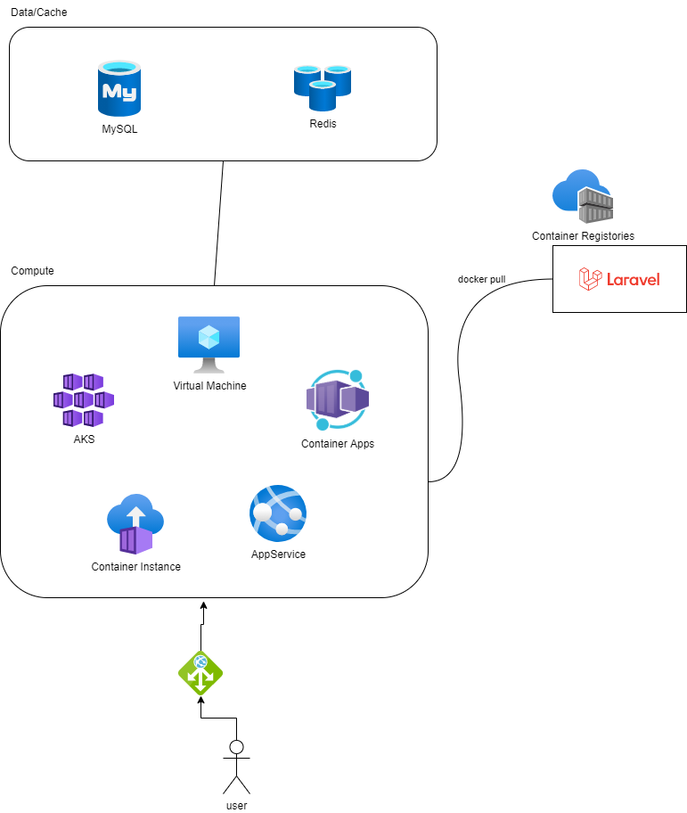

# LaravelアプリをAzureへのデプロイ

コンテナとしていろいろな場所へデプロイしてみる。

Azure Virtual Machine
Azure App Service
Azure Kubernetes Service
Azure Container Instance

## アプリの概要
簡単なWEBアプリ

## いろいろな場所へデプロイしてみる

1. Azure Virtual Machine

2. Azure App Service

3. Azure Kubernetes Service

4. Azure Container Instance

