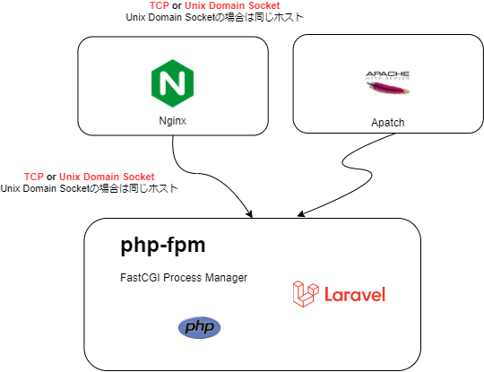
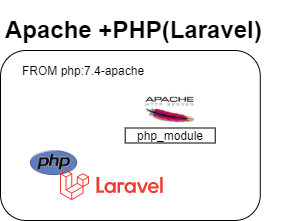
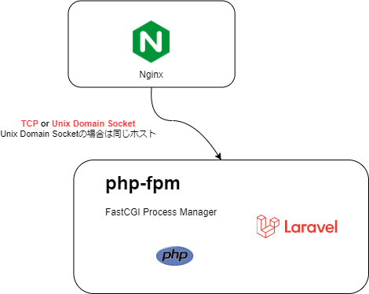

# 運用環境向けのコンテナイメージについて

運用環境はクラウドなどいろいろな環境が想定されるため、コンテナーとしておくのが理想的ということで Laravelアプリ のコンテナイメージ化についての検証。

`php artisan serve`コマンド(PHPの Built-in web server) はあくまで開発環境向け運用環境では基本的に利用しない。  
※試験的なPOC環境やシステム利用者が数名の小さな要件の場合は利用可能(？)

本番環境には `nginx` や `Apache` などを利用する。

(余談) Built-in サーバーの起動は以下のコマンド
```
cd public
php -S localhost:8000
```
## サーバ要件

https://readouble.com/laravel/8.x/ja/deployment.html

(`php -m` で確認)

| - | 確認方法 ||
| --- | --- | --- |
|PHP7.3以上| php -v ||
|BCMath PHP 拡張| php -m \| egrep -i 'bcmath' ||
|Ctype PHP 拡張| php -m \| egrep -i 'ctype' ||
|Fileinfo PHP 拡張| php -m \| egrep -i 'fileinfo' ||
|JSON PHP 拡張| php -m \| egrep -i 'json' ||
|Mbstring PHP 拡張| php -m \| egrep -i 'mbstring' ||
|OpenSSL PHP 拡張| php -m \| egrep -i 'openssl' ||
|PDO PHP 拡張| php -m \| egrep -i 'pdo' ||
|Tokenizer PHP 拡張| php -m \| egrep -i 'tokenizer' ||
|XML PHP 拡張| php -m \| egrep -i 'xml' ||

足りないもの、必要なものはdocker-php-ext-install でインストールする。
※docker-php-ext-install はDocker向けのコマンド

## phpにはWEB Serverが必要 
(例)


## FastCGI版PHP　(php-fpm)とは
FPM ( FastCGI Process Manager ) は PHPのFastCGI実装のひとつで、 主に高負荷のサイトで有用な追加機能を用意しています。 php-fpmはWebサーバーとは別のプロセス、PHP用の永続的なアプリケーションサーバーとして実行されます。

# PHP 公式イメージの利用
https://hub.docker.com/_/php

php:\<version>-apache　と　php-fpm の2パターンを試します。

## php:\<version>-apache
一つのイメージの中にApache, PHP, Laravelが入ります。  
(※05_laravel_basic/my-laravel-basic/Dockerfile で検証)



※ Apache の基本的な設定の知識が少し必要です。都度調べる。php.iniとか

`php:7.4-apache` の `/var/www/html/` にソースコードを含めてイメージを作成します。
```
cat Dockerfile
FROM php:7.4-apache
:
COPY ./ /var/www/html/
:
```

イメージを作成して起動して動作確認
```
docker build -t acr001example/my-laravel-apache-app .
docker run --rm -it -p 8080:80 acr001example/my-laravel-apache-app
```

.env ファイルを環境変数として渡す
```
docker run --rm -it -p 8080:80 --env-file=.env acr001example/my-laravel-apache-app 
```

curlでアクセスできることを確認
```
curl http://localhost:8080/ 
:
    <p>これはテスト用のページです。</p>
:    
```

コンテナ内でプロセスを確認
```
ps -ef | grep apache 
root         1     0  0 02:48 pts/0    00:00:00 apache2 -DFOREGROUND
www-data    17     1  2 02:48 pts/0    00:00:01 apache2 -DFOREGROUND
www-data    18     1  0 02:48 pts/0    00:00:00 apache2 -DFOREGROUND
www-data    19     1  0 02:48 pts/0    00:00:00 apache2 -DFOREGROUND
www-data    20     1  0 02:48 pts/0    00:00:00 apache2 -DFOREGROUND
www-data    21     1  0 02:48 pts/0    00:00:00 apache2 -DFOREGROUND
www-data    22     1  0 02:48 pts/0    00:00:00 apache2 -DFOREGROUND
root        33    23  0 02:49 pts/1    00:00:00 grep apache
```

```
vi /etc/apache2/mods-enabled/mpm_prefork.conf
設定読み直し
/etc/init.d/apache2 reload
```

## .htaccess とは
Webサーバーの基本的な動作を、ディレクトリ単位で制御するためのファイル

rewriteモジュールを有効にする (a2enmod)
```
a2enmod rewrite
```
無効にする場合はa2dismod

```
<IfModule mod_rewrite.c>
    RewriteEngine on

    RewriteRule ^(.*)$ /public/$1 [NC,L,QSA]
</IfModule>
```
### ACR (Azure Container Registory) へ Push
※ Container Registory は DockerHubでも良いなんでもOK。

```
docker images 
REPOSITORY                            TAG                    IMAGE ID       CREATED             SIZE
acr001example/my-laravel-apache-app   latest                 6f1f9bd0f454   About an hour ago   574MB
```
```
az acr login --name acr001example 
az acr build -g b-team-acr --image my-laravel-apache-app:v1 --registry acr001example --file Dockerfile .
docker push acr001example/my-laravel-apache-app
```

## PHP-FPM image
PHP FPM image と Nginx の２つのイメージを利用してみます。

(※05_laravel_basic/docker-compose.yml で検証)

```
05_laravel_basic$ tree -L 1
.
├── docker-compose.yml
├── my-laravel-basic (ソースコード)
├── nginx
└── php-fpm
```

確認
```
cd az-laravel-php-learn/05_laravel_basic

# image build nginx, phpfpm-server
docker build -t my-nginx-proxy    -f nginx/Dockerfile   ./nginx
docker build -t my-php-fpm-server -f php-fpm/Dockerfile .

# network
docker network create --driver bridge my-php-network
docker run -d --rm --net=my-php-network --name php-fpm-server -p 9000:9000 my-php-fpm-server
docker run -d --rm --net=my-php-network --name nginx-proxy    -p 80:80     my-nginx-proxy

docker ps
CONTAINER ID   IMAGE              
2c0d971a85b7   mynginx-proxy
072af6c54861   myphp-fpm-server

# laravel の webルート
curl localhost/greeting
# laravel の apiルート
curl localhost/api/myapi2
```


```
docker-compse up
```