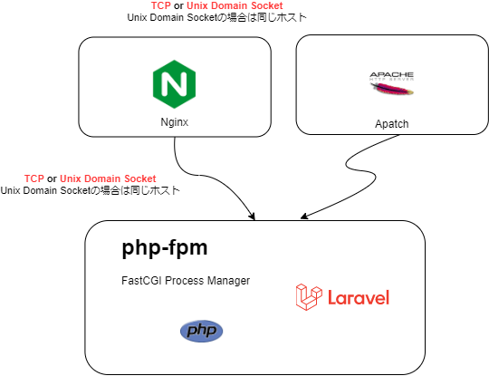

# 本番環境向けのコンテナイメージについて

`php artisan serve`コマンド(PHPの Built-in web server) はあくまで開発環境向け。
本番環境には `nginx` や `Apache` などを利用する。

(余談) Built-in サーバーの起動は以下のコマンド
```
cd public
php -S localhost:8000
```
## サーバ要件

https://readouble.com/laravel/8.x/ja/deployment.html

 nginx x php-fpm

## phpにはWEB Serverが必要 
(例)


## FastCGI版PHP　(php-fpm)とは
FPM ( FastCGI Process Manager ) は PHPのFastCGI実装のひとつで、 主に高負荷のサイトで有用な追加機能を用意しています。 php-fpmはWebサーバーとは別のプロセス、PHP用の永続的なアプリケーションサーバーとして実行されます。

# PHP 公式イメージの利用
https://hub.docker.com/_/php

## php:<version>-apache


※ Apache の基本的な設定の知識が少し必要です。都度調べる。php.iniとか

`php:7.4-apache` の `/var/www/html/` にソースコードを含めてイメージを作成します。
```
cat Dockerfile
FROM php:7.4-apache
:
```

イメージを作成して起動して動作確認
```
docker build -t acr001example/my-laravel-apache-app .
docker run --rm -it -p 8080:80 acr001example/my-laravel-apache-app
```

curlでアクセスできることを確認
```
curl http://localhost:8080/ 
:
    <p>これはテスト用のページです。</p>
:    
```

コンテナ内でプロセスを確認
```
ps -ef | grep apache 
root         1     0  0 02:48 pts/0    00:00:00 apache2 -DFOREGROUND
www-data    17     1  2 02:48 pts/0    00:00:01 apache2 -DFOREGROUND
www-data    18     1  0 02:48 pts/0    00:00:00 apache2 -DFOREGROUND
www-data    19     1  0 02:48 pts/0    00:00:00 apache2 -DFOREGROUND
www-data    20     1  0 02:48 pts/0    00:00:00 apache2 -DFOREGROUND
www-data    21     1  0 02:48 pts/0    00:00:00 apache2 -DFOREGROUND
www-data    22     1  0 02:48 pts/0    00:00:00 apache2 -DFOREGROUND
root        33    23  0 02:49 pts/1    00:00:00 grep apache
```


```
vi /etc/apache2/mods-enabled/mpm_prefork.conf
設定読み直し
/etc/init.d/apache2 reload
```

## .htaccess とは
Webサーバーの基本的な動作を、ディレクトリ単位で制御するためのファイル

rewriteモジュールを有効にする (a2enmod)
```
a2enmod rewrite
```
無効にする場合はa2dismod

```
<IfModule mod_rewrite.c>
    RewriteEngine on

    RewriteRule ^(.*)$ /public/$1 [NC,L,QSA]
</IfModule>
```

## PHP-FPM image
(作成予定)
