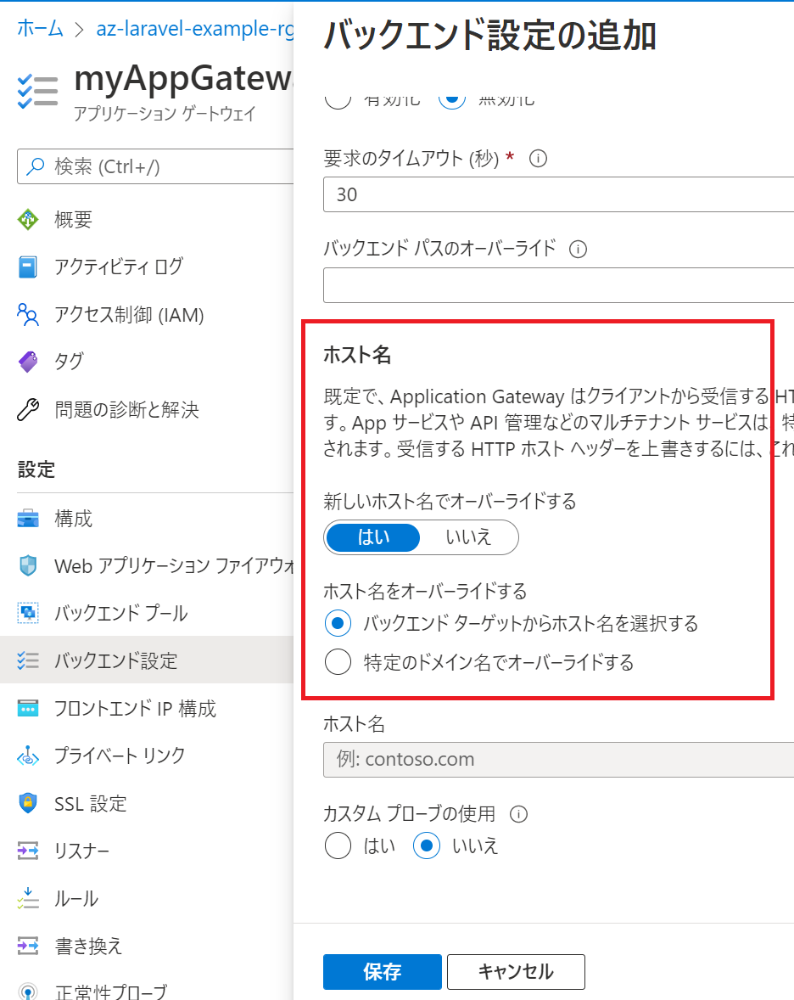

# LaravelアプリをAzureへのデプロイ

コンテナとしていろいろな場所へデプロイしてみる。

Azure Virtual Machine
Azure App Service
Azure Kubernetes Service
Azure Container Instance

## アプリの概要
簡単なWEBアプリ

## いろいろな場所へデプロイしてみる


### 1. Azure Virtual Machine

linux に dockerをインストールしてコンテナを実行する

```
az vm create \
    --resource-group $RG_NAME \
    --name example-vm-ubuntu \
    --image UbuntuLTS \
    --admin-username <USERNAME> \
    --admin-password <PASSWORD>
```

```
docker run -d -p 80:80 acr001example/my-laravel-apache-app
```

### 2. Azure App Service
コードからデプロイする方法とDockerコンテナー(カスタムコンテナ)をデプロイする方法の２種類あります。
#### コードからデプロイする
OSにLinuxを選択してPHPのランタイムスタックは「8.0」「7.4」

```
az appservice plan create -g $RG_NAME -l $LOCATION -n my-example-app-plan --sku P1V2 --is-linux

az webapp up --resource-group $RG_NAME --name my-example-laravel-app \
  --location $LOCATION -p my-example-app-plan --sku P1V2 --runtime "php|7.4"
```

確認
```
curl https://my-example-laravel-app.azurewebsites.net
curl -X POST -d "" https://my-example-laravel-app.azurewebsites.net/api/myapi
curl https://my-example-laravel-app.azurewebsites.net/api/myapi2
```

### カスタムコンテナをデプロイする (ACRから)
```
# plan
az appservice plan create -g $RG_NAME -l $LOCATION -n my-example-app-plan --sku P1V2 --is-linux

# app servcie 作成
az webapp create -g $RG_NAME --plan my-example-app-plan -n app-svc-laravel-container \
  --deployment-container-image-name acr001example.azurecr.io/my-laravel-apache-app8:v1

# マネージド IDを有効にする
managedid=$(az webapp identity assign --resource-group $RG_NAME --name app-svc-laravel-container --query principalId --output tsv)

# ACRのIDを取得
acr_id=$(az acr show --resource-group b-team-acr --name acr001example --query id --output tsv)

# マネージド ID に ACRへのアクセス許可
az role assignment create --assignee $managedid --scope $acr_id --role "AcrPull"

# マネージ ID を使用して Azure Container Registry からプルする設定
az webapp config set --resource-group $RG_NAME --name app-svc-laravel-container \
  --generic-configurations '{"acrUseManagedIdentityCreds": true}'
```
※デプロイ(docker pull)に少し時間がかかります。Logをみながら少し待つ。

####イメージを更新して再デプロイ
イメージを更新した場合は以下のコマンドで再デプロイ ※tagとか変更する　
```
az webapp config container set --name app-svc-laravel-container --resource-group $RG_NAME \
  --docker-custom-image-name acr001example.azurecr.io/my-laravel-apache-app8:v2
```
強制的にPullしなおす方法については別途調べる。

確認
```
curl https://app-svc-laravel-container.azurewebsites.net
curl -X POST https://app-svc-laravel-container.azurewebsites.net/api/mytask
```

### 3. Azure Kubernetes Service

AKSを準備してアプリをデプロイ
```
az aks create -g $RG_NAME -n my-example-aks --enable-managed-identity --node-count 1 --enable-addons monitoring
az aks get-credentials --resource-group $RG_NAME --name my-example-aks
az aks update -n my-example-aks -g $RG_NAME --attach-acr acr001example
kubectl apply -f lb.yml
kubectl apply -f my-deploy.yml
```

確認
```
kubectl get svc
curl http://<EXTERNAL_IP>/
curl http://<EXTERNAL_IP>/api/myapi2
curl -X POST http://<EXTERNAL_IP>/api/myapi2
```

### 4. Azure Container Instance

ACRアクセス用のサービスプリンシパルを作成して Container Instance を作成します。

```
export AKV_NAME=my-example-laravel-key
az keyvault create -g $RG_NAME -n $AKV_NAME

# サービスプリンシパルの作成
ACR_NAME=acr001example
# Create service principal
az ad sp create-for-rbac \
  --name http://$ACR_NAME-pull \
  --scopes $(az acr show --name $ACR_NAME --query id --output tsv) \
  --role acrpull

SP_ID=xxxxxxxxxx # Replace with your service principal's appId

# Store the registry *password* in the vault
az keyvault secret set \
  --vault-name $AKV_NAME \
  --name $ACR_NAME-pull-pwd \
  --value "<PASSWORD>"
  
# Store service principal ID in vault (the registry *username*)
az keyvault secret set \
    --vault-name $AKV_NAME \
    --name $ACR_NAME-pull-usr \
    --value $(az ad sp show --id $SP_ID --query appId --output tsv)

ACR_LOGIN_SERVER=$(az acr show --name $ACR_NAME --resource-group b-team-acr --query "loginServer" --output tsv)

az container create \
    --name my-example-aci-demo \
    --resource-group $RG_NAME \
    --image acr001example.azurecr.io/my-laravel-apache-app8:v1 \
    --registry-login-server acr001example.azurecr.io \
    --registry-username $(az keyvault secret show --vault-name $AKV_NAME -n $ACR_NAME-pull-usr --query value -o tsv) \
    --registry-password $(az keyvault secret show --vault-name $AKV_NAME -n $ACR_NAME-pull-pwd --query value -o tsv) \
    --dns-name-label my-example-aci-demo \
    --query ipAddress.fqdn
```
#### 確認
```
curl http://my-example-aci-demo.japaneast.azurecontainer.io
:
    <p>これはテスト用のページです。</p>
:
```
### 5. Azure Container Apps

ACRアクセス用のサービスプリンシパルを利用して Container Instance を作成します。

```
RESOURCE_GROUP=az-laravel-example-rg
LOCATION=japaneast
CONTAINERAPPS_ENVIRONMENT="my-example-containerapp-env"

az containerapp env create \
  --name $CONTAINERAPPS_ENVIRONMENT \
  --resource-group $RESOURCE_GROUP \
  --location $LOCATION

CONTAINER_IMAGE_NAME=acr001example.azurecr.io/my-laravel-apache-app8:v1
REGISTRY_SERVER=acr001example.azurecr.io
REGISTRY_USERNAME=<SP_ID> # 置き換える
REGISTRY_PASSWORD=<PASSWORD> # 置き換える

az containerapp create \
  --name my-container-app \
  --resource-group $RESOURCE_GROUP \
  --image $CONTAINER_IMAGE_NAME \
  --environment $CONTAINERAPPS_ENVIRONMENT \
  --registry-server $REGISTRY_SERVER \
  --registry-username $REGISTRY_USERNAME \
  --registry-password $REGISTRY_PASSWORD
```

`--allow-insecure` を指定してhttpのリクエストを許可する (確認用)
```
az containerapp ingress enable -n my-container-app -g $RG_NAME \
    --type external --allow-insecure --target-port 80 --transport auto
```

外部からアクセスするためにPortlからContainerAppsのイングレスの設定を行う

#### 確認

```
curl https://my-container-app.bravefield-bc709266.japaneast.azurecontainerapps.io
curl http://my-container-app.bravefield-bc709266.japaneast.azurecontainerapps.io
curl -X POST http://my-container-app.bravefield-bc709266.japaneast.azurecontainerapps.io/api/mytask

curl http://my-container-app.lemongrass-21a26a41.japaneast.azurecontainerapps.io
curl https://my-container-app.lemongrass-21a26a41.japaneast.azurecontainerapps.io
curl https://my-container-app.lemongrass-21a26a41.japaneast.azurecontainerapps.io/api/myapi2
{"message":"myapi2 is working."}
curl -X POST -d "" https://my-container-app.lemongrass-21a26a41.japaneast.azurecontainerapps.io/api/mytask
```

log stream
```
az containerapp logs show --name my-container-app --resource-group $RG_NAME --tail 50
```
az containerapp exec --name my-container-app --resource-group $RG_NAME

#### (補足 サイドカーパターン)　1つのコンテナアプリ(Pod)で複数のコンテナを実行する

[複数のコンテナー](https://learn.microsoft.com/ja-jp/azure/container-apps/containers)について。

(注意)
2022/10 時点では ARMテンプレート で指定する必要がある
```

```
※ ARM テンプレートの利用方法について調べる必要あり
```
az deployment group create --resource-group $RG_NAME --template-file template.json --parameters '@parameters.json'
```

[参考記事](https://zenn.dev/08thse/articles/67-aca-multiple-containers)

※ `az containerapp compose` というコマンドがあるが利用できる？？

### 6. Gateway

vnet, subnet, pip, application gatewayを作成します。

```
az network vnet create --name myVNet --resource-group $RG_NAME --location $LOCATION \
  --address-prefix 10.21.0.0/16 --subnet-name myAGSubnet --subnet-prefix 10.21.0.0/24
az network vnet subnet create --name myBackendSubnet --resource-group $RG_NAME \
  --vnet-name myVNet --address-prefix 10.21.1.0/24
az network public-ip create --resource-group $RG_NAME \
  --name myAGPublicIPAddress --allocation-method Static --sku Standard

az network application-gateway create --name myAppGateway --location $LOCATION --resource-group $RG_NAME \
  --capacity 1 --sku Standard_v2 --public-ip-address myAGPublicIPAddress --vnet-name myVNet --subnet myAGSubnet --priority 1000 
```

#### Application Gateway設定
バックエンド設定で「新しいホスト名でオーバーライドする」※App Service用


バックエンドプールに設定

