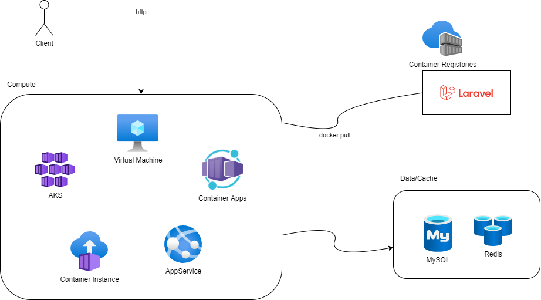
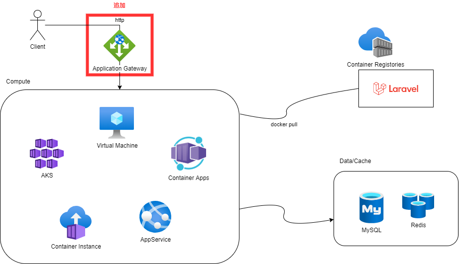

# Laravelアプリ(コンテナ)をAzureへデプロイする


Laravel アプリケーションを Azure へデプロイする方法について調査した結果をブログとして纏めておきます。

Laravel にはdocker-composeを利用したSailと呼ばれる環境構築ツールがありますが、こちらはあくまで開発環境向けということで今回は本番・運用環境はどうするのかという観点での検証です。

本ブログではコンテナ化することで様々な環境で動作することを確認してみようと思います。

## PHP の Laravel とは

Javaの`SpringBoot` や NodeJSの`express` などと同じようにWEBのフルスタックのフレームワーク。フルスタックのWEBアプリとしてだけでなく、APIサーバーとしても利用可能。

(良い点)
WEB開発で必要なものが一通りそろっており日本語のドキュメントも非常に充実しています。
よく利用されるRDB(MySQL,Postgres,SQLServer)やCache(Redis)を利用する仕組みが整っている。
認証・認可の仕組みや並列処理を行うためのQueueの仕組みが整っている。

(悪い点)
特別悪いところは見当たらないが、ネットを検索していると他の言語に比べると処理が遅いという評価があるので、性能要件が極端に厳しいシステムには向いてなさそうですね(リアルタイム処理を求められる処理やIoTには向かない)。一般的なWEBのシステムでは問題ではないでしょう。

## コンテナ化について

必須ではないですが、スケーリングや開発環境の保守という観点で今回はコンテナ化します。

本番・運用環境のLaravelにはWEB Serverが必要になります。
1. Apapche
1. Nginx
がよく利用されます。これらを含めたイメージを作成しました。

作成方法はいろいろありますが、今回は2パターン（php公式イメージを使った方法）を試しました。
php公式イメージは[こちら](https://hub.docker.com/_/php)

### FROM php:x.x.x-apache の利用

Apacheを含めたイメージ(FROM php:8.1.1-apache)をベースにして、
Laravelのソースコード全体をコンテナに含めます。  
コンテナに composer(PHPのライブラリ管理ツール) を含めてLaravel自体のインストールをコンテナ内で行います。  

Clientからのリクエスト(http)を受け取った Apache は `php_module` を介してLaravelにアクセスします。


dockerfile の例 (`php:8.1.1-apache` を利用)
```
FROM php:8.1.1-apache
# 拡張 phpなど
RUN apt update && apt install -y zlib1g-dev g++ libicu-dev zip libzip-dev zip libpq-dev \
    && docker-php-ext-install intl opcache pdo_mysql \
    && pecl install apcu \
    && docker-php-ext-enable apcu \
    && docker-php-ext-configure zip \
    && docker-php-ext-install zip

RUN curl -sS https://getcomposer.org/installer | php -- --install-dir=/usr/local/bin --filename=composer

# laravel アプリのソースをコンテナイメージにコピー
# 秘匿情報がはいっているファイル(.envなど)は .dockerignore で除外しておきます。
COPY ./ /var/www/html/

# PHPライブラリー(laravel等)のインストール
RUN composer install

# .htaccess
RUN a2enmod rewrite
```

### FROM php:x.x.x-fpm の利用
ベースイメージに nginx と php:x.x.x-fpm を利用します。
( FPM とは FastCGI Process Manager の略。Laravelアプリとの高速なプロセス間通信を実現します。 )

下記の用にNginxを含めたイメージと php-fpmを含めたイメージの２つを用意する。  


Clientからのリクエスト(http)を受け取った Nginx は `fpm (TCP通信)` を介してLaravelにアクセスします。

Nginxイメージ  
dockerfile の例 (`nginx:1.22-alpine` を利用)
```
FROM nginx:1.22-alpine
COPY default.conf /etc/nginx/conf.d/default.conf
```

nginxの設定の例  ★の箇所がポイント
```
cat default.conf
server {
:
    location / {
        # ★ すべてのリクエストが/index.phpに行くように設定
        try_files $uri $uri/ /index.php?$query_string;
    }
:
    # pass the PHP scripts to FastCGI server listening on 127.0.0.1:9000
    #
    location ~ \.php$ {
        # ★ rootをphp-fpmのroot
        root           /var/www/html/public;  
        # ★ 転送先のサーバーを指定
        fastcgi_pass   php-fpm-server:9000;
        fastcgi_index  index.php;
        # $document_root を追加しています
        fastcgi_param  SCRIPT_FILENAME  $document_root$fastcgi_script_name;
        include        fastcgi_params;
    }
}
```

php-fpmイメージ  
dockerfile の例 (`php:8.1.1-fpm` を利用)
```
FROM php:8.1.1-fpm

# 拡張 phpなど必要なものを入れます。
RUN apt update && apt install -y zlib1g-dev g++ libicu-dev zip libzip-dev zip libpq-dev \
    && docker-php-ext-install intl opcache pdo_mysql \
    && pecl install apcu \
    && docker-php-ext-enable apcu \
    && docker-php-ext-configure zip \
    && docker-php-ext-install zip

RUN curl -sS https://getcomposer.org/installer | php -- --install-dir=/usr/local/bin --filename=composer

# laravel アプリのソースをコンテナイメージにコピー
# .envに秘匿情報がはいっている場合は .dockerignore で除外します。
COPY my-laravel-basic/ /var/www/html/
RUN composer install
```

## アプリケーションについて

アプリケーションはRedisとMySQLを利用した標準的なアプリ構成

session情報をRedisに格納し、アプリケーションデータをmysqlに格納します。

## Laravelアプリケーションのデプロイ

Azureではコンテナの実行環境として複数あるのですが、以下の５つに php:x.x.x-apacheをベースにしたコンテナをデプロイしてみました。

1. Azure Virtual Machine
1. Azure App Service
1. Azure Kubernetes Service
1. Azure Container Instance
1. Azure Container Apps

手順を記載すると長くなってしまうので、[こちら](https://github.com/APCt-okuyama/az-laravel-php-learn/tree/main/07_deploy_azure)に纏めておきます。  
それぞれのアプリにclientから問題なくhttpでアクセスできるところまで確認しました。

# まとめ

今回、検証で作成した環境は最終的に以下のようになりました。
コンテナ化するのに少し時間がかかりました（調査含めて２，３日くらい）が、コンテナ化さえしてしまえばそれほど手間をかけずにいろいろ環境を構築できます。
どのサービスも運用環境として利用することは可能だと思いますが、あえて一つお勧めするなら管理が簡単な App Service (カスタムコンテナ) が良いのではないかと思いました。



# (おまけ)　簡単にパフォーマンスを確認

ロードバランサーとして Application Gateway を配置して、少し負荷をかけてみました。


## １万リクエスト
処理内容は テーブルに単純に１レコード追加するだけの処理。
JMeterを使って１万リクエスト(20 thread 500 requests)を投入、結果は約 5分くらいで完了。

追加されたレコードの件数を数えてみるとそれぞれ均等に処理されることが確認できました。
```
mysql> select count(*), remark from mytask group by remark;
+----------+--------------------------------------------+
| count(*) | remark                                     |
+----------+--------------------------------------------+
|     2500 | ce0b546c9de9                               |app service
|     2499 | laravel-app-apache-db4d68cf-6h2bs          |aks
|     2501 | my-container-app--yiv5488-6878f5768c-tl4k9 |container apps
|     2500 | SandboxHost-637939684234638543             |container instance
+----------+--------------------------------------------+
4 rows in set (0.05 sec)
```
※remarkはhostname
※ホスト名がそれぞれのサービスで違います。

## throttle:api
連続してリクエストを投げてみたところ「429 Too Many Requests」となり調べてみるとLaravelの流量制御(throttle:api)が効いていました。

設定を変更することで調整可能。
```
cat RouteServiceProvider.php
    protected function configureRateLimiting()
    {
        RateLimiter::for('api', function (Request $request) {
            //return Limit::perMinute(60)->by(optional($request->user())->id ?: $request->ip());
            return Limit::perMinute(60*10)->by(optional($request->user())->id ?: $request->ip());            
        });
    }
```
Laravelにはこのように流量制御なども基本的な機能として準備されているのが良いところですね。
