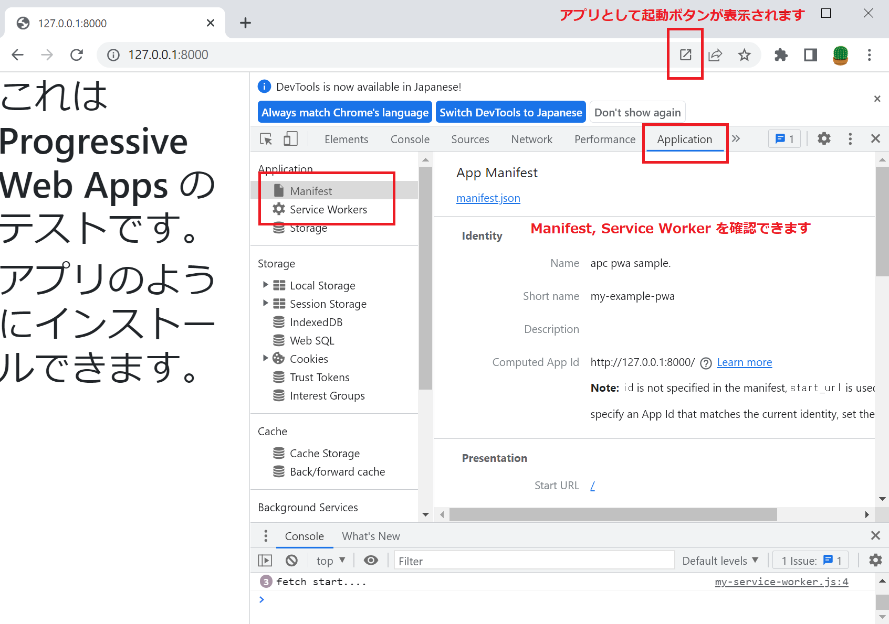
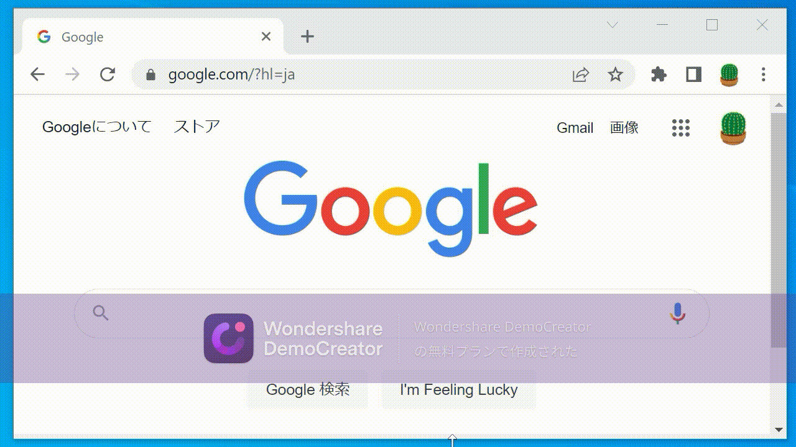

# Progressive Web Apps

[Progressive Web Apps とは](https://developer.mozilla.org/ja/docs/Web/Progressive_web_apps)

※現在、正式な標準ではない。

(key words)
httpsが必須  
サービスワーカーと呼ばれるスクリプトによりオフライン操作を実現  
アプリがユーザーにどのように表示されるかを制御  

# Dev環境
```
php -v
PHP 7.4.3 (cli) (built: Jun 13 2022 13:43:30) ( NTS )
composer -V
Composer version 2.3.9 2022-07-05 16:52:11

# javascriptを利用するのでnodeが必要
node -v 
v14.18.1
npm -v
6.14.15
```

# Laravel で試してみる

https://web.dev/add-manifest/

## Laravel プロジェクトの作成

laravel projectの作成
```
composer create-project --prefer-dist laravel/laravel my-laravel-pwa
cd my-laravel-pwa
npm install
```
※Laravel Mix (webpackのラッパー)を利用するために `npm install` が必要

## PWA関連の設定 (最低限)

1. マニフェストファイル manifest.json の配置
1. fetch ハンドラーをもつサービスワーカーの登録

★が関連するファイル　（追加、または変更）
```
├── public
│   ├── css
│   │   └── app.css
│   ├── favicon.ico
│   ├── ic_launcher192x192.png　★
│   ├── ic_launcher48x48.png　★
│   ├── ic_launcher96x96.png　★
:   :
│   ├── manifest.json ★
│   ├── mix-manifest.json
│   ├── my-service-worker.js　★
│   └── robots.txt
├── resources
│   ├── css
│   │   └── app.css
│   ├── js
│   │   ├── app.js
│   │   └── bootstrap.js
:   :
│   └── views
│       └── welcome.blade.php ★
:
└── webpack.mix.js ★
```

## public/my-service-worker.js
``` 
console.log('start sw.js ...')
//fetchのみ
self.addEventListener('fetch', e => {
    console.log('fetch start....')
});
```

## resources/views/welcome.blade.php 
1. manifest.jsonを読み
2. サービスワーカーの登録
```
<html>

<head>
    <meta name="viewport" content="width=device-width,initial-scale=1.0,minimum-scale=1.0">
    <link rel="manifest" href="/manifest.json">
    <link href="https://stackpath.bootstrapcdn.com/bootstrap/4.4.1/css/bootstrap.min.css" rel="stylesheet">
</head>

<body>
    <h1>これは Progressive Web Apps のテストです。</h1>

    <h1>アプリのようにインストールできます。</h1>

    <script>
        if('serviceWorker' in navigator) {
            navigator.serviceWorker.register('my-service-worker.js')
            .then( r => {
                console.log('register service worker success.');
            })
            .catch(error => {
                console.log('register service worker fail.');
            });
        }
    </script>
</body>
```

サービスワーカー(今回の場合は)

## Chromeブラウザ (DevTool) で確認



1. ブラウザに「アプリ起動」ボタンが表示されます。
1. DevToolでManifest・Service Workerを確認できます。

## Azure App Service

jsをビルドしてからデプロイする
```
npm run prod
```

HTTPS経由で提供する必要がある為、今回は App Servcie を利用

AppServiceプランを作成
```
az appservice plan create -g $RG_NAME -l $LOCATION -n my-example-app-plan --sku P1V2 --is-linux
```

AppServiceへデプロイ
```
az webapp up --resource-group $RG_NAME --name my-example-laravel-php74-pwa \
  --location $LOCATION -p my-example-app-plan --sku P1V2 --runtime "php|7.4"
```
"php|7.4"の場合は apacheが利用されます。.htaccess が必要です。  
"php|8.0"の場合は nginx,fpmが利用されます。.htaccessは不要ですが、別途設定が必要です。 

Browserでアクセスすると Progressive Web Apps として認識されています。
```
https://my-example-laravel-php74-pwa.azurewebsites.net
```



スマホでもアクセスしてみる。